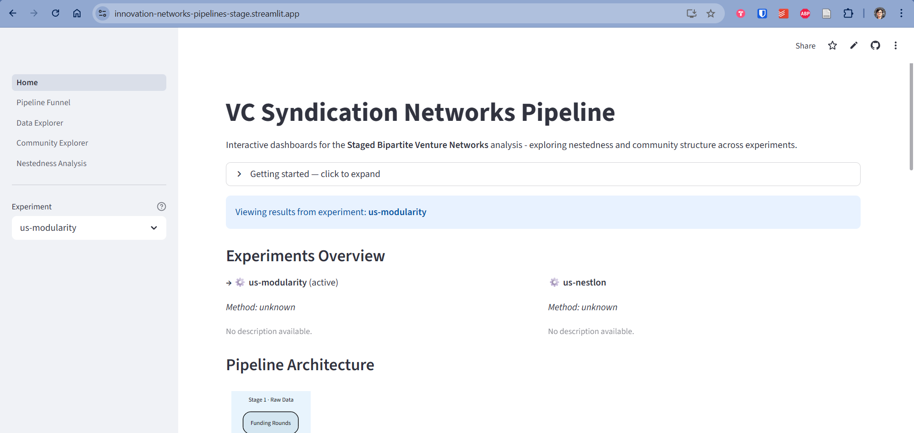

# Innovation Networks Pipelines

A multi-country, multi-method, experiment-driven research platform for analyzing structural properties of innovation networks — investor syndication, enterprise co-investment, and beyond. Built around reproducible [Bruin](https://github.com/bruin-data/bruin) pipelines and interactive Streamlit dashboards, it supports adding new countries, datasets, and network analysis methods incrementally.

## Contents

- [Dashboard](#dashboard)
- [Motivation](#motivation)
- [What's Inside](#whats-inside)
- [Project Structure](#project-structure)
- [Prerequisites](#prerequisites)
- [Quick Start](#quick-start)
- [Adding a New Experiment](#adding-a-new-experiment)
- [Clustering Methods](#clustering-methods)
- [References](#references)

## Dashboard

The interactive dashboard lets you explore any experiment without writing code — switch between pipeline layers, inspect community structure, and visualize nestedness results in real time.

> **Live app:** [innovation-networks-pipelines.streamlit.app](https://innovation-networks-pipelines.streamlit.app/)



Community Explorer lets you navigate detected communities, inspect their bipartite composition, and render the network graph interactively.


Nestedness Analysis surfaces Johnson g_norm charts, degree-vs-nestedness scatter plots, and asymmetry breakdowns across all investor roles.


## Motivation

This repository bridges **academic research** and **production-grade data engineering**. It reimplements the data processing and network analysis workflows originally developed as exploratory Jupyter notebooks in the [innovation-networks-exploration](https://github.com/joaomelga/innovation-networks-exploration) project into structured, reproducible pipelines — making experiments comparable, extensible, and shareable.

## What's Inside

- **Bruin pipelines** for ingesting, cleaning, and transforming Crunchbase venture capital data
- **Graph construction** of bipartite investor syndication networks with pluggable community detection
- **Nestedness analysis** using the Johnson et al. (2013) methodology
- **NESTLON algorithm** (Grimm & Tessone, 2017) for nestedness-aware community detection
- **DuckDB** as local analytical warehouse (one per experiment)
- **Interactive Streamlit dashboards** for exploring pipeline data, communities, and nestedness results

## Project Structure

```
innovation-networks-pipelines/
├── .bruin.yml               # Bruin project configuration
├── lib/                     # Shared Python library
│   ├── graph/               # Graph construction, clustering methods (modularity, NESTLON)
│   ├── nestedness/          # Nestedness calculators (Johnson JDM-NODF)
│   └── utils/               # DuckDB helpers, bipartite matrix utilities
├── data/                    # Shared raw data (CSV.GZ, git-lfs tracked)
│   ├── us/                  # US Crunchbase data
│   └── fr/                  # France Crunchbase data
├── experiments/             # Bruin experiment pipelines (raw → reports)
│   └── us-modularity/       # US data + greedy modularity community detection
│       ├── pipeline.yml
│       ├── config.yml       # country: us, clustering_method: modularity
│       └── assets/          # raw/ staging/ core/ graph/ experiments/ reports/
└── dashboard/               # Streamlit multi-experiment dashboard
    ├── 0_Home.py
    └── pages/
```

Each experiment is a **self-contained Bruin pipeline** with its own DuckDB. Adding a new experiment (country or clustering method) means adding a new directory under `experiments/` with a different `config.yml`.

## Prerequisites

### uv (Python package manager)

This project uses [uv](https://docs.astral.sh/uv/) to manage Python dependencies per directory. Install it by following the [official installation guide](https://docs.astral.sh/uv/getting-started/installation/).

### Bruin CLI

Install the [Bruin CLI](https://github.com/bruin-data/bruin) to run the data pipelines.

## Quick Start

### 1. Run the us-modularity experiment

```bash
# Install Python dependencies
cd experiments/us-modularity
uv sync
cd ../..

# Validate pipeline assets
bruin validate experiments/us-modularity

# Run the full pipeline (use --workers 1 on Windows to avoid DuckDB lock issues)
bruin run experiments/us-modularity --workers 1
```

The pipeline runs in layer order: `raw` → `staging` → `core` → `graph` → `experiments` → `reports`.

To run a single asset or a specific layer:
```bash
# Run from a specific asset onward
bruin run experiments/us-modularity --downstream experiments/us-modularity/assets/graph/graph_nodes.py

# Run a single asset
bruin run experiments/us-modularity/assets/experiments/johnson/exp_johnson_nestedness.py
```

### 2. Launch the Streamlit dashboard

```bash
cd dashboard
uv sync
uv run streamlit run 0_Home.py
```

The dashboard auto-discovers any experiment with a populated DuckDB file. Use the **Experiment** selector in the sidebar to switch between experiments. Pages available:

| Page | Description |
|---|---|
| Home | Pipeline overview, key metrics, nestedness summary |
| Pipeline Funnel | Record counts at each layer, filter breakdowns |
| Data Explorer | Geography, sectors, funding distributions, temporal trends |
| Community Explorer | Community structure, bipartite composition, network visualization |
| Nestedness Analysis | Johnson g_norm charts, degree vs nestedness scatter, asymmetry analysis |

## Adding a New Experiment

To add a new country or clustering method:

1. Create `experiments/<name>/` with a `pipeline.yml`, `config.yml`, `pyproject.toml`, and `assets/`
2. Set `clustering_method` in `config.yml` to `modularity` or `nestlon`
3. Add a DuckDB connection entry to `.bruin.yml`
4. Run with `bruin run experiments/<name> --workers 1`

The dashboard will automatically pick up the new experiment's DuckDB file.

## Clustering Methods

Methods are registered in `lib/graph/` and selected via `config.yml`:

| Method | `config.yml` value | Description |
|---|---|---|
| Greedy modularity | `modularity` | Optimizes modularity Q (Newman) |
| NESTLON | `nestlon` | Detects nested components via local neighborhood containment (Grimm & Tessone, 2017) |

## References

- Melga, J., Leroy, B., & Dalle, J.-M. (2026). *Staged Bipartite Venture Networks: Preliminary evidence of asymmetric nestedness in the Silicon Valley*. Extended abstract.
- Johnson, S., Domínguez-García, V., & Muñoz, M. A. (2013). Factors determining nestedness in complex networks. *PLoS ONE*, 8(9).
- Grimm, A., & Tessone, C. J. (2017). Analysing the sensitivity of nestedness detection methods. *Applied Network Science*, 2, 21.

## Author

**João Melga** — [GitHub](https://github.com/joaomelga)
